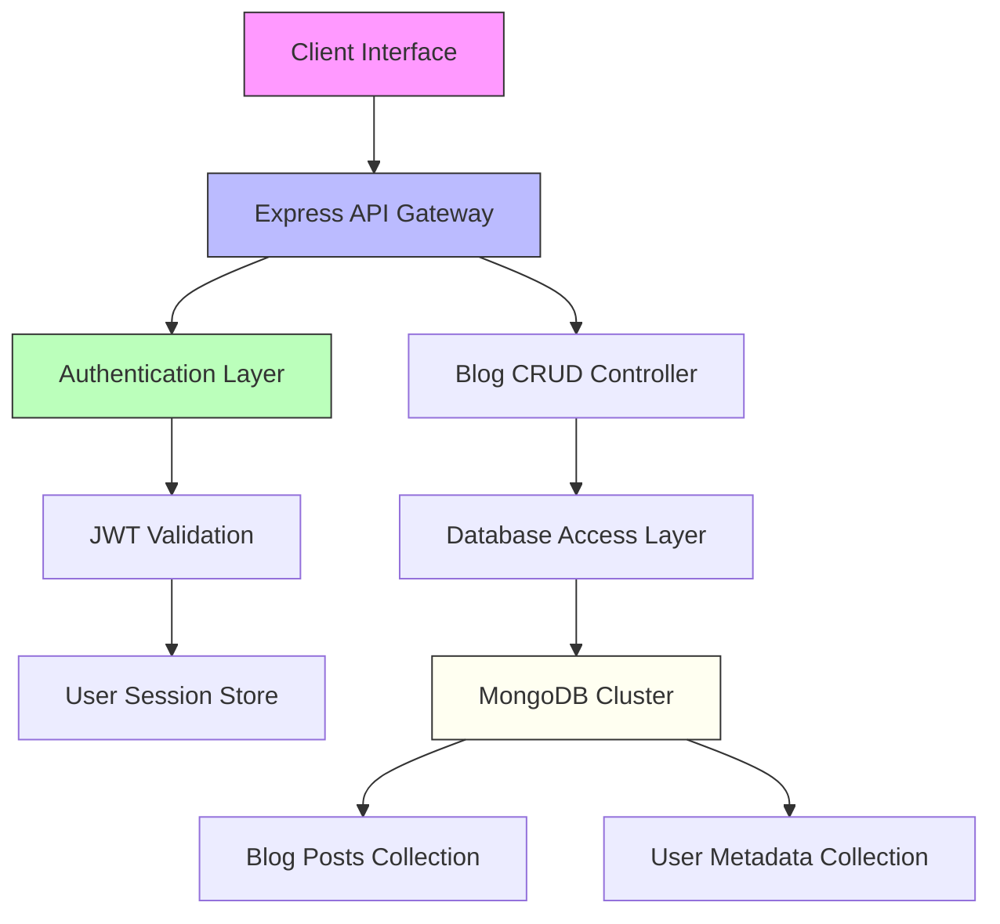

# 🚀 BlogSite

<p align="center">
    
    
    
    
</p>

<p align="center">
    <b>BlogSite</b> — The modern, full-stack blog platform. Create, share, and upvote blogs with a beautiful UI and seamless experience.
</p>

---

## ✨ Features

- 📝 Create, Read, Update, Delete (CRUD) blogs
- 🔒 JWT-based authentication
- 🚀 Fast, modern frontend (Vite + React)
- 📈 Upvote and interact with posts
- 👥 Add music queue streaming (coming soon!)
- 🎨 Responsive, eye-catching UI

---

## 🧑‍💻 Quick Login

Want to try it out? Use the demo credentials:

```text
Email: random@gmail.com
Password: visiter
```

---

## 📁 Project Structure

```text
BlogSite/
├── backend/
│   ├── app.ts
│   ├── routes/
│   ├── prisma/
│   └── ...
├── common/
│   └── src/
├── frontend/
│   ├── src/
│   │   ├── components/
│   │   ├── pages/
│   │   └── ...
│   └── public/
└── README.md
```

---

## 🏗️ Architecture Overview



---

## 🚦 Getting Started

1. Clone the repo: `git clone https://github.com/AadityaLamichhane/BlogSite.git`
2. Install dependencies for backend & frontend:
     - `cd backend && npm install`
     - `cd ../frontend && npm install`
3. Set up environment variables (see `.env.example`)
4. Run backend: `npm run dev` (from backend folder)
5. Run frontend: `npm run dev` (from frontend folder)
6. Visit the app in your browser!

---

## 🛠️ Tech Stack

- TypeScript, Node.js, Express
- React, Vite
- Prisma ORM
- MongoDB

---

## 🤝 Contributing

Pull requests are welcome! For major changes, please open an issue first to discuss what you would like to change.

---
